### WFSEND1, WFRECV1 画面付き操作手順

1. 送信側 (WFSEND1) → 親機 「はい」
    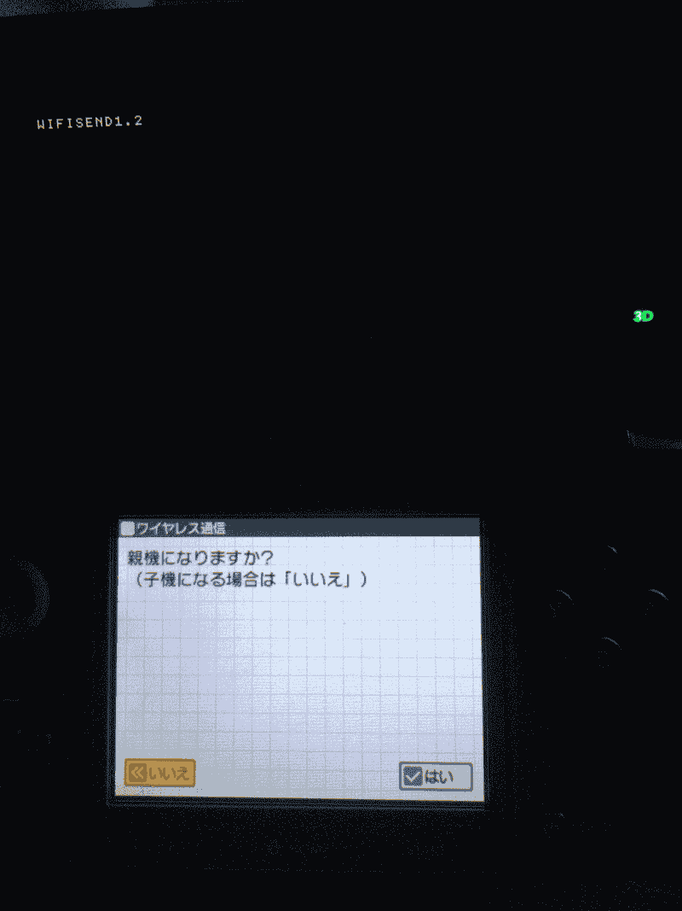

1. 受信側 (WFRECV1) → 子機 「いいえ」
    

1. 送信側 何もしない
    

1. 受信側 親機の名前をタッチする
    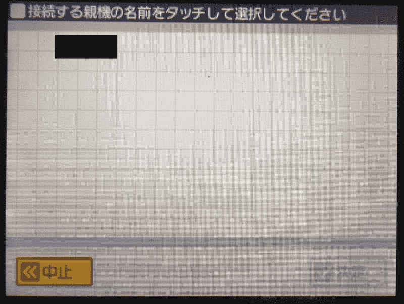

1. 受信側 「決定」
    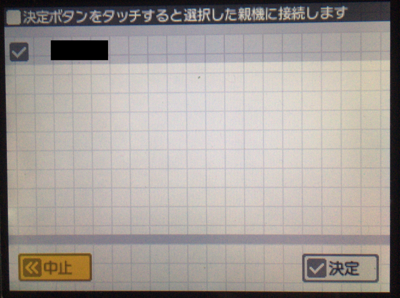

1. 送信側 子機が表示されたら「実行」
    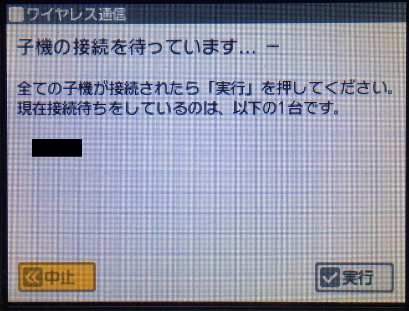

    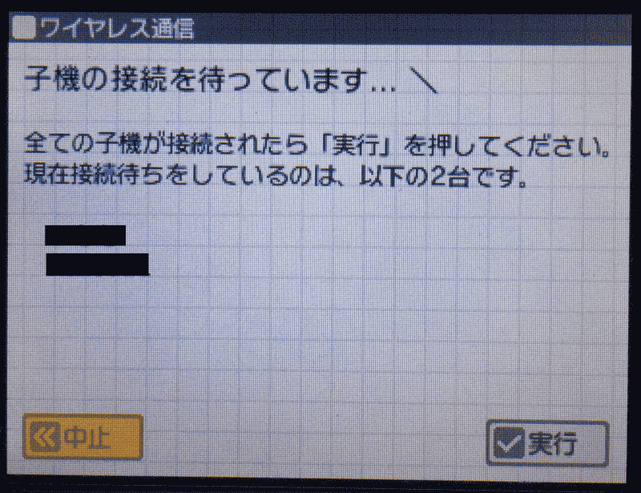

1. 受信側 同期完了を待つ
    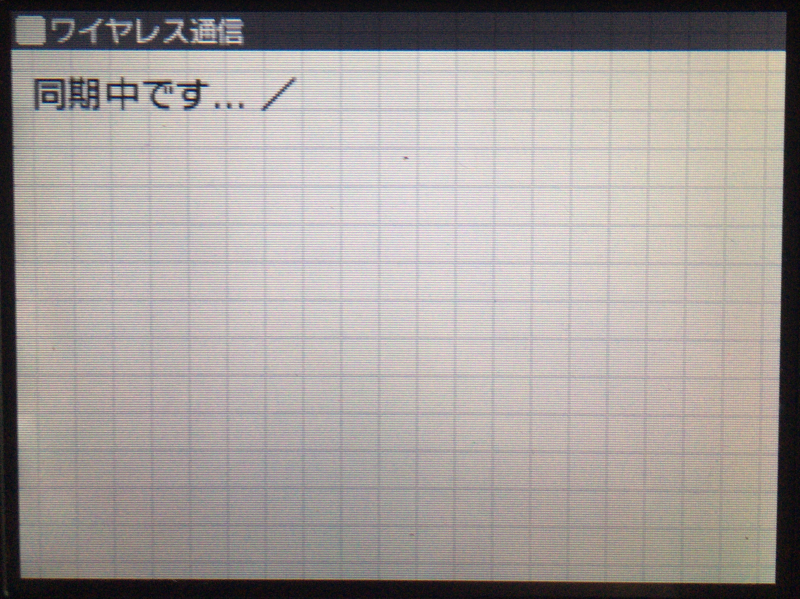

1. 送信側 「WAITING RECVSTART」と表示されることを確認
    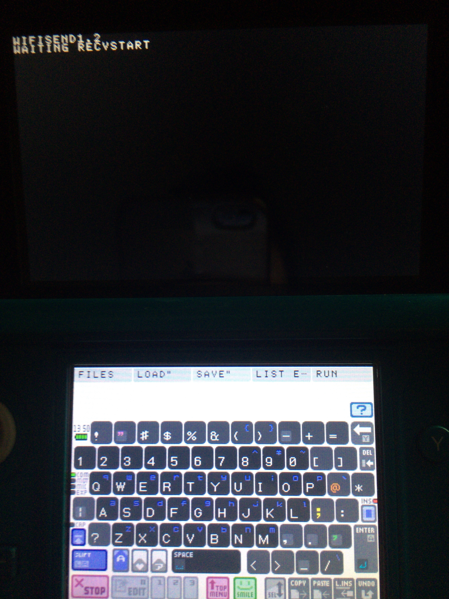

1. 受信側 受信できる状態の合図としてボタンを押す (A,B,X,Y,L,Rのどれか)
    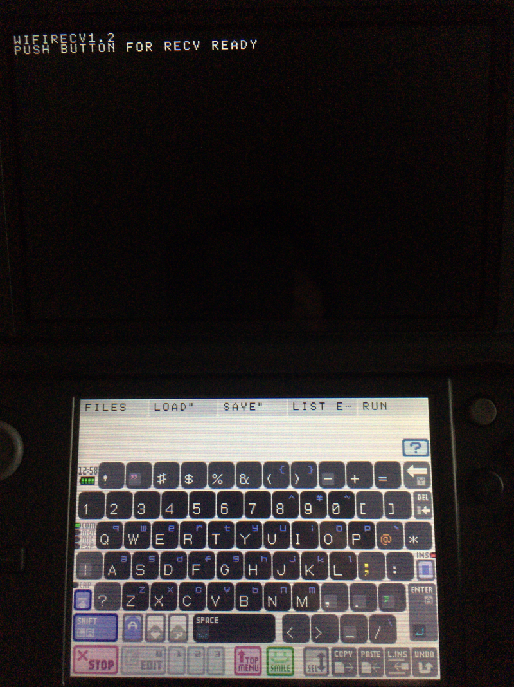

1. 送信側 何もしない。送信完了すると、受信側の完了を待ってワイヤレス通信を切断する
    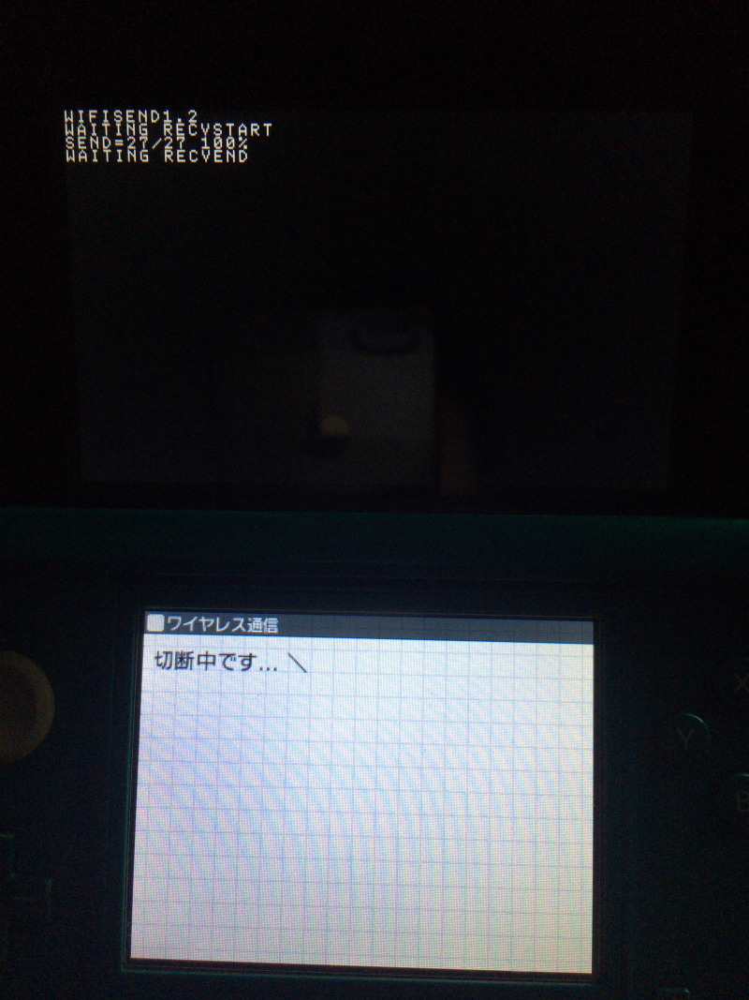

1. 受信側 受信完了すると終了する。受信したプログラムはSLOT3にあるので、問題なければ保存など。
    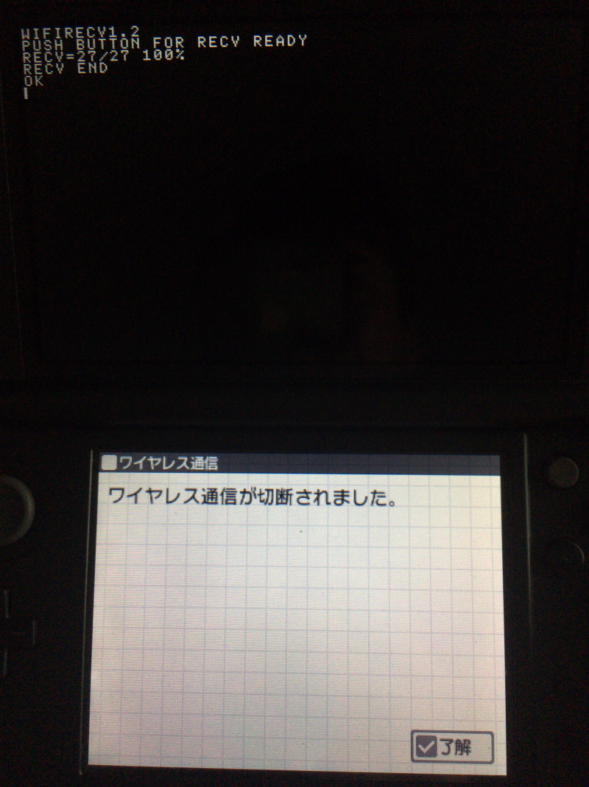

## シーケンス図
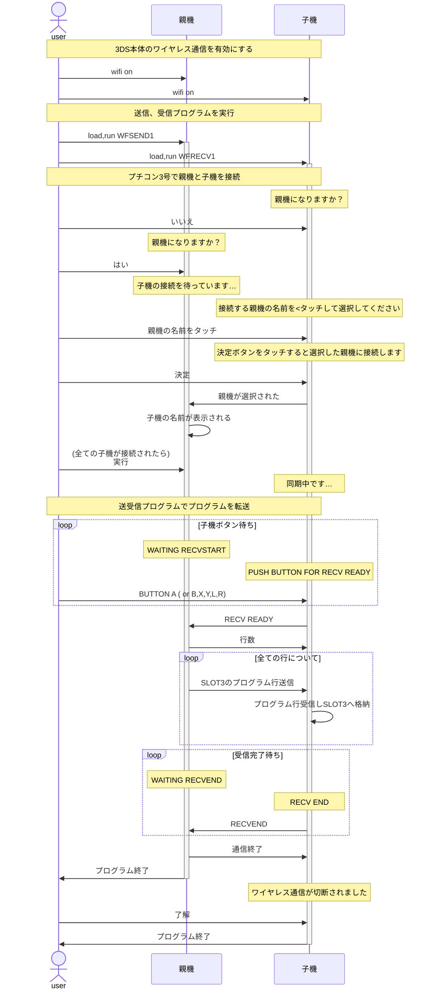
