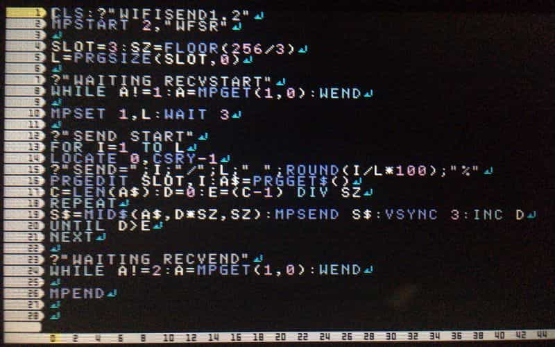
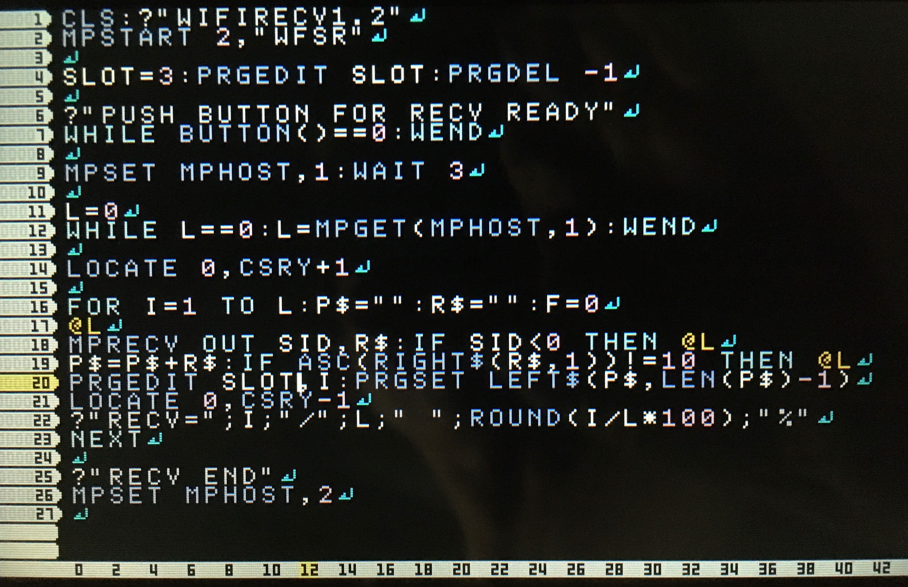
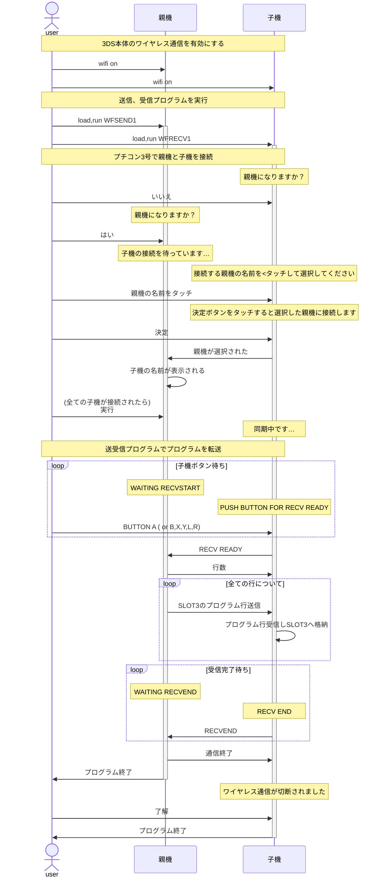

# [petitcom3] wifiでプログラム送受信

プチコン3号のワイヤレス通信でプログラムを送受信するプログラムです。

pcから3DSにファイルをPetitModemで転送しようとしたところ、ニンテンドーネットワークで3DSの扱いがなくなり公開キーでDLできなくなってました。でも1台にはDLしてあったので、もう片方に入れるために作りました。

それぞれのプログラムは1画面もないので、短く入力に時間がかかりません。その代わりエラー制御はありません…

## 使い方

### 準備
* プチコン3号が入った3DS本体が2つ必要です。

    * 送信側に[WFSEND1](#wfsend1)を打ち込む、またはLOAD
    
    * 受信側に[WFRECV1](#wfrecv1)を打ち込む、またはLOAD

### 実行

1. 3DS本体のワイヤレス通信を有効にする

1. 送信、受信プログラムを実行

    * 送信側(親機)でWFSEND1を実行

    * 受信側(子機)でWFRECV1を実行

1. プチコン3号で親機と子機を接続

    * 送信側、受信側の画面に従って操作

    > 手順詳細は [画面付き手順](./ptcm3_ConnectHostClient.md) 参照

1. 送受信開始

    * 送信側 「WAITING RECVSTART」と表示されることを確認

    * 受信側 受信できる状態の合図としてボタンを押す (A,B,X,Y,L,Rのどれか)

1. 送受信終了

    * 送信側 何もしない。送信完了すると、受信側の完了を待ってワイヤレス通信を切断する

    * 受信側 受信完了すると終了する。受信したプログラムはSLOT3にあるので、問題なければ保存など。

## プログラム

* WFSEND1 

* WFRECV1 

## シーケンス図

## FAQ
* 送信側のSZ
    
    MPSENDが256バイトまでであるのに対し、UNICODE文字があり行が長い場合に256バイトを超過しエラーとなることへの対策として、送信対象のプログラムの行を分割するための文字数です。
    WFSEND1では3で割っていて殆どの場合大丈夫です。でも4バイトのUNICODE文字が多くあるとエラーになってしまうので、エラーになるようなデータをどうしても扱う場合は調整が必要です。
    とはいえ、このプログラムで送受信するのはほぼ送受信用のプログラムと想定される(長大なプログラムやファイルは別の送受信プログラムが適している)ので、たぶんないとおもいます。
    
* 送信ウエイト
    
    MPSEND後、VSYNC3待って次を実行しています。一応手元の環境では145KBくらいの日本語テキストファイル(SKK-JISYO.M)が送信できています。環境によっては4のほうがよいかも知れません。
    
* 初代3DSでワイヤレスネットワーク切断 (MPEND)
    
    時間がかかることが多いので待ちましょう。New3DSは結構早いようです。2DSは持っていないのでわかりません…
    
* プログラムを打ち込むのは大変
    
    WFSEND1は打ち込み1回だけでよいです。WFSEND1でWFSEND1を送信できます。
    WFRECV1は受信したい本体毎に打ち込みが必要です…
    
* 需要あるの？
    
    switchにプチコン4があり、3DSはニンテンドーネットワークもおわってしまい、そんな中で3DSを使い、かつ複数台3DSを持ち、さらにプチコン3号を両方にDL済であり、その上2台間でプログラムを転送したい…と考える人はそれだけいることでしょう？
    
* なんでシーケンス図？
    
    mermaid.jsで書いてみたかったのと、プチコン3号のワイヤレス接続に手続きがたくさんあるのですが、あまり説明しているところを見つけられなかったためです。(公式ガイドブックとかリファレンスブックを所有していないので確認できませんが、ちゃんと記載しているのかも) プチコン3号で送受信しようとするようなユーザは、説明があまりなくてもできてしまいそうですが。
    図ではうまく表現できていないとこがありそうですが、ないよりはましレベルにはなっているといいですね。
    
* ほんとにFAQ?
    
    はい。FAQ (Few Answered Queries) です。
    日本語では「蛇足」が近いでしょうか。
    