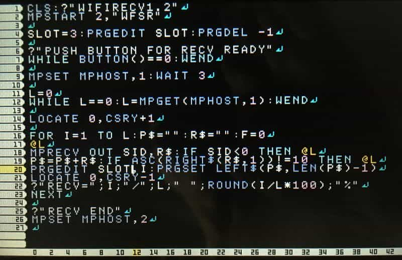

# [petitcom3] wifiでプログラム送受信 説明書、プログラム

プチコン3号のワイヤレス通信でプログラムを送受信するプログラムです。

## 使い方

### 準備
* プチコン3号が入った3DS本体が2つ必要です。

    * 送信側に[WFSEND1](#wfsend1)を打ち込む、またはLOAD
    
    * 受信側に[WFRECV1](#wfrecv1)を打ち込む、またはLOAD

### 実行

1. 3DS本体のワイヤレス通信を有効にする

1. 送信、受信プログラムを実行

    * 送信側(親機)でWFSEND1を実行

    * 受信側(子機)でWFRECV1を実行

1. プチコン3号で親機と子機を接続

    * 送信側、受信側の画面に従って操作

    > 手順詳細は [画面付き操作手順](./ptcm3_ConnectHostClient.md) 参照

1. 送受信開始

    * 送信側 「WAITING RECVSTART」と表示されることを確認

    * 受信側 受信できる状態の合図としてボタンを押す (A,B,X,Y,L,Rのどれか)

1. 送受信終了

    * 送信側 何もしない。送信完了すると、受信側の完了を待ってワイヤレス通信を切断する

    * 受信側 受信完了すると終了する。受信したプログラムはSLOT3にあるので、問題なければ保存など。

## プログラム

* WFSEND1 

* WFRECV1 

